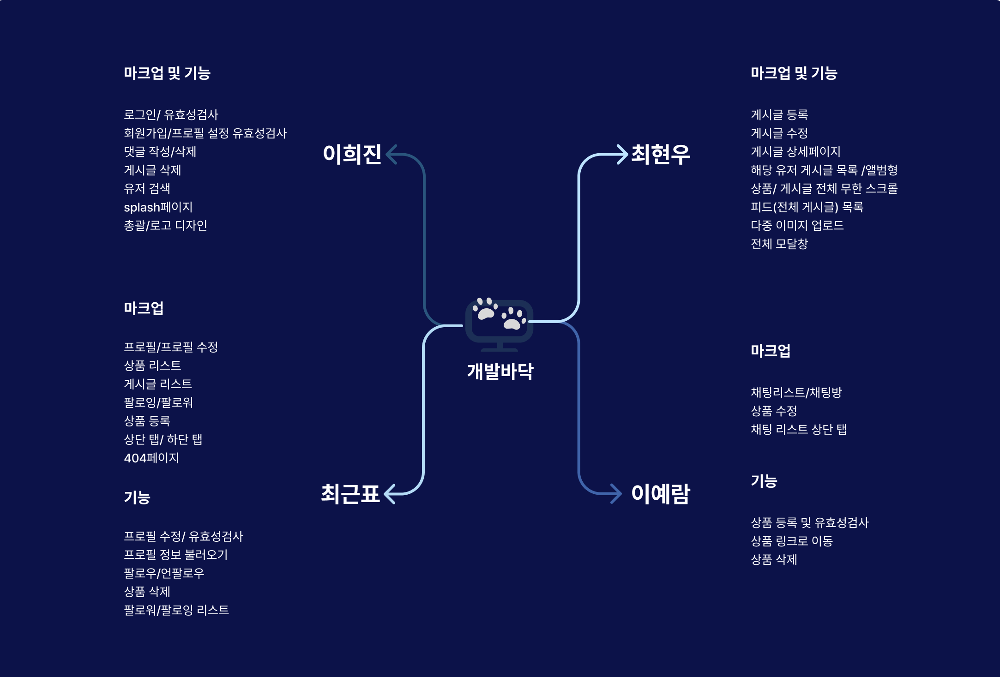

# dev-floor
<div>
    
</div>
<br>
테스트 계정

```
ID: dev_floor@test.com
PW: 123123123
```
## 0. 목차

1.  [프로젝트 소개](#1-프로젝트-소개)
2.  [팀원 소개](#2-팀원-소개)
3.  [기술 스택](#3-기술-스택)
4.  [구현 기능 및 역할](#4-구현-기능-및-역할)
5.  [기능 UI](#5-기능-UI)
6.  [커밋 컨벤션](#6-커밋-컨벤션)
7.  [협업 방식](#7-협업-방식)
8.  [아쉬운점 & 개선할점](#8-아쉬운점-&-개선할점)

## 1. 프로젝트 소개

### [프로젝트 소개]

개발바닥은 다양한 개발자들이 모여, 개발 정보 및 구직정보를 공유하며 소통하는 개발 커뮤니티 입니다.
개발 관련 물품을 추천하고, 자신의 구직 후기와 개발 정보를 기록하고, 공유 하는 등
직접적으로 개발 관련된 정보를 얻을 수 있으며, 댓글과 좋아요 기능으로
서로 소통할 수 있는 개발자 SNS입니다.


### [프로젝트 개발기간]


<br>

## 2. 팀원 소개
<table style="margin:0 auto;">
  <tbody>
    <tr>
      <td align="center"><a href="https://github.com/geunpyochoi"><br /><b>FE 팀장 : 최근표</b></a><br /></td>
      <td align="center"><a href="https://github.com/kyokyoYa"><br /><b>FE 팀원 : 최현우</b></a><br /></td>
      <td align="center"><a href="https://github.com/leeheezin"><br /><b>FE 팀원 : 이희진</b></a><br /></td>
      <td align="center"><a href="https://github.com/dpfka97"><br /><b>FE 팀원 : 이예람</b></a><br /></td>
    </tr>
  </tbody>
</table>

<br>

## 3. 기술 스택
<table>
<tr>
 <td align="center" width="100px">사용 기술</td>
 <td width="800px">
  &nbsp  
  &nbsp 
   &nbsp 
  &nbsp 
   &nbsp 
   &nbsp
    </td>
</tr>
<tr>
 <td align="center">패키지</td>
 <td>
    &nbsp 
  </td>
</tr>
<tr>
 <td align="center">협업</td>
 <td>
    &nbsp 
    &nbsp
    &nbsp  
 </td>
 <tr>
  <td align="center">디자인</td>
 <td>
    &nbsp  
 </td>
</tr>
<tr>
 <td align="center">IDE</td>
 <td>
    &nbsp
</tr>
</table>
<br>

- **Recoil**을 택한 이유
1. 편리한 비동기 처리
- useRecoilState나 useRecoilValue등의 API를 사용하여 비동기 데이터를 상태로 관리하면서도 간단하게 데이터 흐름을 제어할 수 있습니다.
- 비동기 처리시 async/await 문법을 사용할 수 있습니다.
2. 유연한 상태관리
- React의 UseState훅과 비슷하게 동작하고 직관적이면서 간단한 구조를 가져 코드의 양을 줄일 수 있었습니다.
- 프로젝트 규모가 크지 않아 Recoil이 Redux에 비해 적합하다 생각하였습니다.
- Recoil을 사용하면 컴포넌트 간에 상태와 로직을 공유하거나 분리할 수 있으며, 코드 구조를 더 유연하고, 설계할 수 있습니다.
3. 성능 최적화
- 특정 상태의 변경이 발생할 때 해당 상태를 사용하는 컴포넌트들만 다시 렌더링되도록 최적화가 되어있습니다.

4. TypeScript 호환 
- Recoil은 TypeScript와의 호환성이 좋아 추후 리팩토링을 타입스크립트로 진행할 예정으로 선택하였습니다. 
5. recoil-Persist
- 유저정보의 지속성을 위해 사용한 recoil-Persist
- recoil은 기본적으로 새로고침 또는 컴포넌트 언마운트 시 상태가 초기화되지만, recoil-persist를 사용하면서 세션 스토리지에 저장하여 지속성을 유지하였습니다.

    <br>
- axios 라이브러리 활용
  - 비동기로 HTTP 통신을 할 수 있어 return을 promise 객체로 해주기 때문에 response 데이터를 쉽게 다루기 위해 사용하였습니다.
  - Promise 기반의 API를 제공하여 비동기적인 방식으로 HTTP 요청을 처리하였습니다.
  - fetch와 비슷하지만, axios는 기본적으로 JSON타입을 사용할 수 있고,   코드를 간결하게 작성하여 가독성을 높일 수 있었습니다.
    <br><br>

- **Styled-components**을 택한 이유
    - 컴포넌트를 기반으로 스타일링 할 수 있어 재사용 할 수 있고, 코드 가독성과 유지보수성을 위해 사용했습니다.
<br>
<br>
## 4. 구현 기능 및 역할

### [구현 기능]
- **🔑Account**

  - 로그인/로그아웃
  - 로그인/ 회원가입/프로필 유효성 검사
  - 회원가입 진행
  - 프로필 정보 설정

- **📄 Post**
  - 게시글 등록/수정/삭제
  - 모달창
  - 이미지 3장 업로드
  - 모든 유저 게시글 목록
  - 해당 유저 게시글 목록
  - 게시글 상세페이지
  <!-- - 팔로잉 게시글 목록 -->

- **🛒 Product**
    - 상품 등록
    - 상품 수정
    - 상품 삭제

- **⌨️ Commemt**

  - 댓글 등록/수정/삭제

- **🔎 Search**

  - 유저 검색

- **👨‍💼 Profile**

  - 개인 프로필/프로필 유효성 검사
  - 프로필 수정
  - 팔로우/언팔로우
  - 팔로우/팔로잉 리스트

- **❤️ Like**

  - 게시물 좋아요 및 취소

<br/>

### [역할]
<div>
    
</div>

### [폴더 구조]
```
📦src
 ┣ 📂api
 ┃ ┣ 📜AuthApi.js
 ┃ ┣ 📜PostApi.js
 ┃ ┣ 📜ProductApi.js
 ┃ ┗ 📜ProfileApi.js
 ┣ 📂assets
 ┃ ┗ 📂images
 ┣ 📂components
 ┃ ┣ 📂feed
 ┃ ┃ ┣ 📜Feed.jsx
 ┃ ┃ ┗ 📜FeedStyle.jsx
 ┃ ┣ 📂modal
 ┃ ┃ ┣ 📜ChatModal.jsx
 ┃ ┃ ┣ 📜ChatModalStyle.jsx
 ┃ ┃ ┣ 📜LogoutModal.jsx
 ┃ ┃ ┣ 📜LogoutModalStyle.jsx
 ┃ ┃ ┣ 📜Modal.jsx
 ┃ ┃ ┣ 📜ModalComDel.jsx
 ┃ ┃ ┣ 📜ModalPostDel.jsx
 ┃ ┃ ┣ 📜ModalProduct.jsx
 ┃ ┃ ┣ 📜ModalStlye.jsx
 ┃ ┃ ┗ 📜PostModal.jsx
 ┃ ┣ 📂postalbum
 ┃ ┃ ┣ 📜PostAlbum.jsx
 ┃ ┃ ┗ 📜PostAlbumStyle.jsx
 ┃ ┣ 📂postlist
 ┃ ┃ ┣ 📜PostList.jsx
 ┃ ┃ ┗ 📜PostListStyle.jsx
 ┃ ┣ 📂product
 ┃ ┃ ┣ 📜Product.jsx
 ┃ ┃ ┗ 📜ProductStyle.jsx
 ┃ ┣ 📂search
 ┃ ┃ ┣ 📜SearchInput.jsx
 ┃ ┃ ┗ 📜SearchInputStyle.jsx
 ┃ ┣ 📂tab
 ┃ ┃ ┣ 📜TabMenu.jsx
 ┃ ┃ ┗ 📜TabMenuStyle.jsx
 ┃ ┗ 📂topbar
 ┃ ┃ ┣ 📜TopBarBasic.jsx
 ┃ ┃ ┣ 📜TopBarFollowers.jsx
 ┃ ┃ ┣ 📜TopBarFollowing.jsx
 ┃ ┃ ┣ 📜TopBarModify.jsx
 ┃ ┃ ┣ 📜TopBarSave.jsx
 ┃ ┃ ┣ 📜TopBarSaveStyle.jsx
 ┃ ┃ ┗ 📜TopBarStyle.jsx
 ┣ 📂font
 ┃ ┗ 📜font.css
 ┣ 📂pages
 ┃ ┣ 📂404
 ┃ ┃ ┣ 📜Error.jsx
 ┃ ┃ ┗ 📜ErrorStyle.jsx
 ┃ ┣ 📂addproduct
 ┃ ┃ ┣ 📜AddProduct.jsx
 ┃ ┃ ┗ 📜AddProductStyle.jsx
 ┃ ┣ 📂chat
 ┃ ┃ ┣ 📜Chat.jsx
 ┃ ┃ ┣ 📜ChatRoom.jsx
 ┃ ┃ ┣ 📜ChatRoomStyle.jsx
 ┃ ┃ ┗ 📜ChatStyle.jsx
 ┃ ┣ 📂editproduct
 ┃ ┃ ┣ 📜EditProduct.jsx
 ┃ ┃ ┗ 📜EditProductStyle.jsx
 ┃ ┣ 📂follow
 ┃ ┃ ┣ 📜Followers.jsx
 ┃ ┃ ┣ 📜FollowersStyle.jsx
 ┃ ┃ ┣ 📜Following.jsx
 ┃ ┃ ┗ 📜FollowingStyle.jsx
 ┃ ┣ 📂home
 ┃ ┃ ┣ 📜Home.jsx
 ┃ ┃ ┗ 📜HomeStyle.jsx
 ┃ ┣ 📂join
 ┃ ┃ ┣ 📜EmailJoin.jsx
 ┃ ┃ ┣ 📜Join.jsx
 ┃ ┃ ┣ 📜JoinStyle.jsx
 ┃ ┃ ┗ 📜ProfileJoin.jsx
 ┃ ┣ 📂login
 ┃ ┃ ┣ 📜Login.jsx
 ┃ ┃ ┣ 📜LoginHome.jsx
 ┃ ┃ ┣ 📜LoginHomeStyle.jsx
 ┃ ┃ ┗ 📜LoginStyle.jsx
 ┃ ┣ 📂post
 ┃ ┃ ┣ 📜Post.jsx
 ┃ ┃ ┣ 📜PostStyle.jsx
 ┃ ┃ ┣ 📜PostWrite.jsx
 ┃ ┃ ┗ 📜PostWriteStyle.jsx
 ┃ ┣ 📂profile
 ┃ ┃ ┣ 📜MyProfile.jsx
 ┃ ┃ ┣ 📜MyProfileStyle.jsx
 ┃ ┃ ┣ 📜Profile.jsx
 ┃ ┃ ┗ 📜ProfileStyle.jsx
 ┃ ┣ 📂profile-modification
 ┃ ┃ ┣ 📜ProfileModification.jsx
 ┃ ┃ ┗ 📜ProfileModificationStyle.jsx
 ┃ ┗ 📂splash
 ┃ ┃ ┗ 📜Splash.jsx
 ┣ 📂state
 ┃ ┣ 📜AuthAtom.js
 ┃ ┣ 📜FollowAtom.js
 ┃ ┣ 📜ModifyAtom.js
 ┃ ┣ 📜PostAtom.js
 ┃ ┗ 📜ProductAtom.js
 ┣ 📂styles
 ┃ ┗ 📜GlobalStyle.js
 ┣ 📜App.js
 ┣ 📜index.css
 ┣ 📜index.js
 ┣ 📜reportWebVitals.js
 ┗ 📜webpack.config.js
```

## 5. 기능 UI

<table style="margin:0 auto;">
  <tbody>
    <tr>
      <td align="center">
      <p>시작 화면</p>
      <br /></td>
      <td align="center">
      <p>회원 가입</p>
      <a href="https://github.com/FRONTENDSCHOOL7/final-17-dev-floor/assets/28581469/b5246db6-eeb6-4a70-8c0a-47fb97f40511" height="100%;" alt=""/></a><br /></td>
      <td align="center">
      <p>프로필 설정</p>
      <a href="https://github.com/geunpyochoi"></a><br /></td>
    </tr>
  </tbody>
</table>

<table>
  <tbody>
      <tr>
        <td align="center">
          <p>로그인</p>
          
        </td>
      <td align="center">
        <p>검색하기</p>
        
      </td>
      <td align="center">
        <p>마이 프로필</p>
          
      </td>
      </tr>
  </tbody>
</table>

<table>
<tbody>
  <tr>
      <td align="center">
        <p>팔로우 & 언팔로우</p>
        
      </td>
      <td align="center">
          <p>채팅리스트 & 채팅방</p>
        
      </td>  
      <td align="center">
          <p>홈 피드</p>
        
      </td> 
  </tr> 
</tbody>
</table>

<table>
<tbody>
  <tr>
      <td align="center">
          <p>좋아요</p>
        
      </td>
      <td align="center">
          <p>게시글 상세</p>
        
      </td>  
      <td align="center">
          <p>댓글 작성</p>
        
      </td>  
  </tr>
</tbody>
</table>

<table>
<tbody>
  <tr>
      <td align="center">
          <p>댓글 삭제</p>
        
      </td>
      <td align="center">
          <p>프로필 수정</p>
        
      </td>  
      <td align="center">
          <p>게시글 등록/삭제/수정</p>
        
      </td>  
  </tr>
</tbody>
</table>

<table>
<tbody>
    <tr>
        <td align="center">
            <p>게시글 리스트/ 앨범형</p>
          
        </td>
        <td align="center">
            <p>상품 등록/수정/이동/삭제</p>
          
        </td>  
        <td align="center">
            <p>로그아웃</p>
          
        </td>  
    </tr>
</tbody>
</table>

<table>
  <tbody>
    <tr>
      <td align="center" width="33%;">
          <p>404</p>
        
      </td>
      <td>
      </td>  
      <td>
      </td>  
    </tr>
  </tbody>
</table>

<br>

## 6. 커밋 컨벤션
<detail>
  <table>
    <tr>
      <th>커밋 메세지</th>
      <th>의미</th>
    </tr>
    <tr>
      <td>Feat</td>
      <td>새로운 기능 추가</td>
    </tr>
    <tr>
      <td>BugFix</td>
      <td>버그 & 에러 수정</td>
    </tr>
    <tr>
      <td>Docs</td>
      <td>리드미 등 문서 수정</td>
    </tr>
    <tr>
      <td>Style</td>
      <td>코드 포맷팅, 세미콜론 누락, 코드 변경이 없는 경우</td>
    </tr>
    <tr>
      <td>Design</td>
      <td>UI 디자인 변경</td>
    </tr>
    <tr>
      <td>Refactoring</td>
      <td>코드 리팩토링</td>
    </tr>
    <tr>
      <td>Chore</td>
      <td>기타 변경사항</td>
    </tr>
    <tr>
      <td>Rename</td>
      <td>파일명 혹은 폴더명 수정, 위치 옮기기</td>
    </tr>
    <tr>
      <td>Remove</td>
      <td>파일 삭제</td>
    </tr>
    <tr>
      <td>Move</td>
      <td>파일 혹은 폴더 위치 수정</td>
    </tr>
    <tr>
      <td>Comment</td>
      <td>주석 추가 및 변경</td>
    </tr>
    <tr>
      <td>Distribution</td>
      <td>파일 배포</td>
    </tr>
  </table>
</detail>
<br>

## 7. 협업 방식
- **스크럼**

  스크럼을 매일 오전 10시에 각 구성원의 기능 계획을 공유하고, 오후 5시30분에 진행 상황과 겪은 문제, 해결 방안을 공유하였습니다.

- **라이브 쉐어**

  라이브 쉐어 프로그램을 사용하여 오류나 어려움이 있는 부분을 함께 해결하고, 기술적 중요도가 높은 파트에서는 함께 작업함으로써 전체 코드에 대한 각 구성원들의 이해도를 높였습니다.

- **깃플로우**

    main - 최종 머지하는 배포 branch<br>
    feature - 각자 기능 개발 완료후 합쳐지는 branch로 1명 조원의 승인후 merge합니다.

<br>

## 8. 아쉬운점 & 개선할점
1. 커스텀 훅을 활용하지 않고 중복 코드를 작성한 부분이 많아 코드 가독성과 유지보수가 어려워진 점이 아쉬웠습니다. 리팩토링때는 커스텀훅을 만들어 효율적으로 적용해볼 예정입니다.

2. GitHub 이슈를 활용하지 않았습니다. 이슈를 통해 프로젝트의 진행 상황을 효과적으로 추적하고 문제를 관리할 수 있었을 텐데, 이 기회를 놓친 것이 아쉬워서 추후 리팩토링때는 활용할 예정 입니다.

3. 리코일로 상태관리를 하면서 처음 적용하다보니 마구잡이로 구현하게 되어 중복도 많아져 오류가 생기기도 했습니다. 더 쳬게적이고 일관성있게 리팩토링 할 예정입니다.